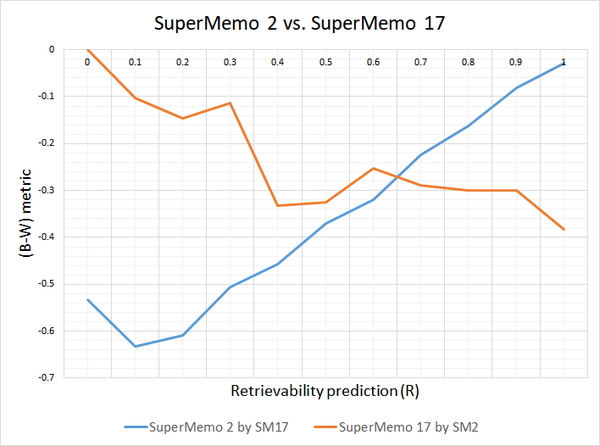

# LEETCODING

A repository for solving and summarizing coding problems in preparation for technical interviews.
I explore different facets of study aids for coding interviews and document the process for the struggling code-monkey I am, but could be a style suitable for the next primordial programmer.

KEYSTONE TECHNIQUES AND TALENTS
- SPACED REPETITION
- GRADUAL PROGRESSION
- BORING VARIATIONS

## HARTMAN PROFICIENCY TAXONOMY

1. FAMILIARITY: recognizing flows, mental models, and patterns
2. COMPREHENSION: discussing the patterns
3. CONSCIOUS EFFORT: experimenting and learning through trying everything
4. CONSCIOUS ACTION: mastering the pattterns by knowing what to try
5. PROFICIENT: finding and manipulating unseen patterns
6. UNCONSCIOUS COMPETENCE: simple

## LUHMANN'S ZETTELKASTEN

```
[Learning How to Read](https://luhmann.surge.sh/learning-how-to-read)
What are we to do with what we have written down? Certainly, at first, we will produce mostly garbage. But we have been educated to expect something useful from our activities and soon lose confidence if nothing useful seems to result. We should, therefore, reflect on whether and how we arrange our notes so that they are available for later access.
```

## FLASH CARDS

I sought out some reviews of the flash card softwares out there because I find the manual handwriting of flash cards to be unproductive, especially since the actual coding is done on a screen! Fortunately white board technology has been invented to aid in handwriting concepts much easier, but we lose the repetition quality the flash cards offer. This repetition is better known as spaced repetition, learning technique based on increasing intervals of time between subsequent review of the learned material. 
 - **SuperMemo (from "Super Memory")** is a learning method and software package developed by SuperMemo World and SuperMemo R&D with Piotr Woźniak in Poland from 1985 to the present.
    - They have archived a lovely list of bullet points chronologically depicting the [History of SuperMemo](https://super-memory.com/english/history.htm), which reads from Hermann Ebbinghaus's Forgetting curve (1885) => Robert Bjork's theory of disuse (1969) => to finally Piotr Wozniak's computational spaced repetition, i.e. the technique in which knowledge is reviewed in optimum intervals that are determined by a computer with the goal of reaching a desired level of knowledge retention.
 ```
Misattributions unconscious influences Interpreting the subjective sense of perceptual fluency or familiarity poses a challenge of sorts for the
learner. Prior exposures to stimuli can have long-term priming effects that influence not only the objective speed and/or accuracy of our ability to
perceive or identify those stimuli, but also our subjective sense of fluency or familiarity... We are susceptible, therefore, to unconscious influences of
prior events, which can take the form of our misaHributing the source or cause of our sense of perceptual fluency.

...

Our level of learning or knowledge, however, is only one of a number of possible contributors to fluent retrieval. In their analysis, Benjamin and Bjork
( 1996) distinguish four other "determinants11 of fluent retrieval: frequency and recency of usage, episodic distinctiveness, cue sufficiency, and priming.
Frequency and recency of usage play an important role because the ad of retrieval is itself a learning event, in that the retrieval of information makes
that information more retrievable in the future. An item of information that has been accessed frequently will tend to be characterized by fluent retrieval
at the current point in time. Episodic distinctiveness refers to the collectio of factors, such as salience, emotionality, and temporal isolation, that makes 
events distinct, hence more readily recallable. Cue sufficiency denotes the effectiveness of the cues guiding the retrieval of desired facts, information, or
procedures. To the extent that those cues are underspecified-that is, associated with multiple items in memory-retrieval of any one item will be
slowed, made less reliable, or both, owing to the competitive dynamics that characterize retrieval processes in human memory
(cf. the cue overload principle; e.g., Watkins and Watkins 1975). Finally, as in the discussion of perceptual fluency, priming, refers to the
effects of mere prior exposure of some target item. There is now abundant evidence that prior presentation of an item, even in a context nominally unrelated
to some current task of interest, can increase the speed or likelihood that the item, among other possible items, is retrieved in response to a cue of some kind.

...

There are two reasons, then, why it is important to create desirable difficulties for the learner during training. One reason is that manipulations such
as varying the conditions of practice, reducing feedback to the learner, sequencing materials and tasks to be learned in ways that cause "contextual
interference," and spacing rather than massing practice sessions, enhance long-term retention and transfer. The other reason is that such manipulations
also have the potential to inform the learners' own subjective experiences. In the context of the total training experience, such manipulations give learners
the opportunity to experience the forgetting, errors, and mistakes that result from changes in task or contextual cues, from interference owing to interpolated
or prior learning, from reduced feedback, and so forth. In an optimal training environment, the learners' successes become more informative as well-that is,
become a more valid basis for confidence because they constitute more reliable evidence that skills and knowledge will remain accessible over time and in altered circumstances.  
```
  - For a detailed description of the first SM algorithm see: [Using SuperMemo without a computer](https://super-memory.com/articles/paper.htm)


 - **Anki** is a free and open-source flashcard program and implements the SM-2 algorithm, read more on the [SuperMemo algorithm (SM-2)](https://en.wikipedia.org/wiki/SuperMemo#Description_of_SM-2_algorithm),
    - The SM-2 algorithm in Anki been modified to allow priorities on cards and to show flashcards in order of their urgency. Anki 23.10+ also has a native implementation of the Free Spaced Repetition Scheduler (FSRS) algorithm, which allows for more optimal spacing of card repetitions.

**So which is software and algorithm implementation is better?**
- SuperMemo currently uses [SM-18](https://supermemo.guru/wiki/Algorithm_SM-18) and its hard to find a definitive answer due to the nature of the validity for metrics of proving one's ability for retrieval and retention (but there is a technical comparison for [SM-17 vs. older SuperMemos](https://supermemopedia.com/wiki/Algorithm_SM-17_vs._older_SuperMemos)).


Below is a graph of the result of simulation that SM-17 is better than SM-2
(pulled from https://www.masterhowtolearn.com/2018-11-11-my-comparison-between-anki-and-supermemo/)


"The least squares metric for Alg SM-2 equals ~54% as compared to ~37% for Algorithm SM-17. This does not sound like a lot, but it may easily double or triple the review workload (esp. for shorter intervals).”

- Based on this we can say in the long-term SuperMemo is superior, although it simply locked to Windows making it hard access and manage on my GNU/Linux Desktop. I will be using Anki (on Ubuntu 22.04) with a modern spaced-repetition scheduler, which you can check out here at [FSRS4Anki](https://github.com/open-spaced-repetition/fsrs4anki).

...

## SYSTEM DESIGN

...
